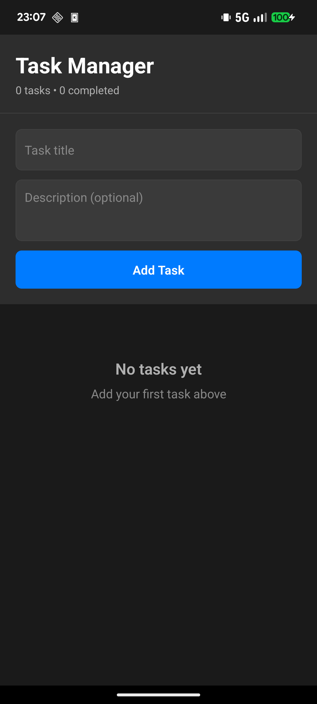
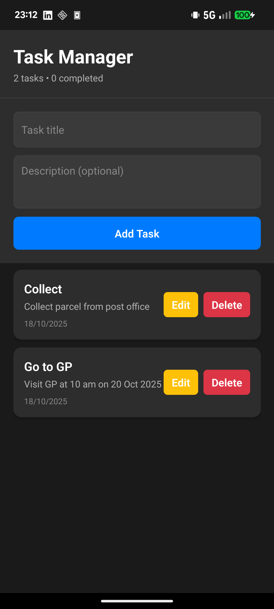
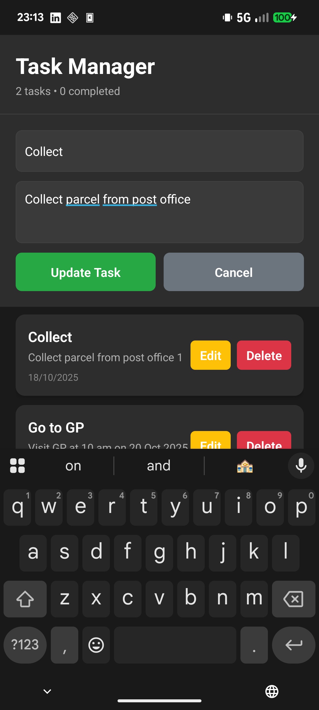
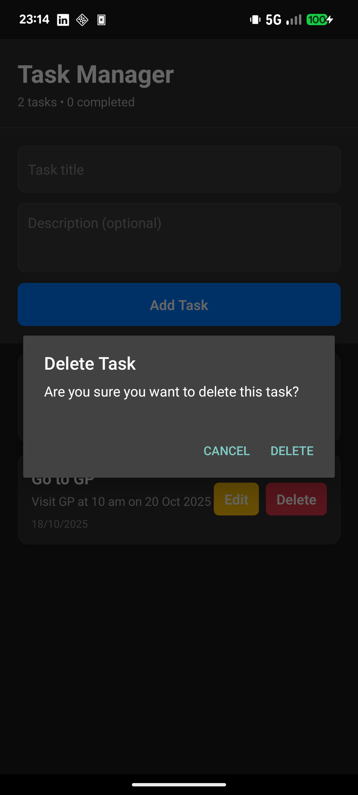

# Task Manager Mobile App

A simple React Native mobile application demonstrating CRUD (Create, Read, Update, Delete) operations. Built for job application demonstration purposes.

## Features

✅ **Create** - Add new tasks with title and description  
✅ **Read** - View all tasks in a clean, organized list  
✅ **Update** - Edit existing tasks and toggle completion status  
✅ **Delete** - Remove tasks with confirmation dialog  
✅ **Persistence** - Data saved locally using AsyncStorage  
✅ **Dark Mode** - Automatic theme adaptation with proper contrast  
✅ **Custom Icon** - Professional app icon with task management theme  
✅ **Modern UI** - Clean, professional design with consistent styling  

## Tech Stack

- **React Native** 0.72.6
- **TypeScript** for type safety
- **AsyncStorage** for local data persistence
- **React Hooks** (useState, useEffect)
- **FlatList** for efficient list rendering

## Screenshots & Demo

### 📱 App Features Showcase

<div align="center">

| Dark Mode Support | Task Management | Edit Functionality | Delete Confirmation |
|:---:|:---:|:---:|:---:|
|  |  |  |  |
| Automatic dark/light theme | Create, view, and manage tasks | Edit existing tasks inline | Safe delete with confirmation |

</div>

### ✨ Key Features Demonstrated

- **🌙 Dark Mode Support** - Automatically adapts to system theme with proper contrast
- **📝 Complete CRUD Operations** - Create, Read, Update, Delete with intuitive UI
- **✅ Task Status Management** - Toggle completion with visual feedback
- **🎨 Professional UI/UX** - Clean, modern design with consistent styling
- **💾 Data Persistence** - Tasks saved locally using AsyncStorage
- **🔒 Safe Operations** - Confirmation dialogs for destructive actions
- **📱 Native Performance** - Built with React Native for smooth interactions

## Quick Start

### Option 1: Docker (Recommended - No Setup Required!)

**Prerequisites:** Docker installed on your system

1. **Clone and navigate to the project:**
   ```bash
   cd /home/anish/Documents/Code/mobileApp
   ```

2. **Run with Docker Compose:**
   ```bash
   docker compose up -d
   ```

3. **Open your browser:**
   ```
   http://localhost:3000
   ```

4. **Stop the application:**
   ```bash
   docker compose down
   ```

### Option 2: Native React Native

**Prerequisites:**
- Node.js (>= 16)
- React Native CLI
- Android Studio (for Android) or Xcode (for iOS)

1. **Install dependencies:**
   ```bash
   npm install
   ```

2. **Start Metro bundler:**
   ```bash
   npm start
   ```

3. **Run on device/emulator:**
   
   For Android:
   ```bash
   npm run android
   ```
   
   For iOS:
   ```bash
   npm run ios
   ```

### Option 3: Web Version (Quick Demo)

1. **Start local web server:**
   ```bash
   cd web && python3 -m http.server 3000
   ```

2. **Open browser:**
   ```
   http://localhost:3000
   ```

## Code Structure

```
mobileApp/
├── App.tsx              # Main React Native component
├── web/
│   └── index.html      # Web version of the app
├── package.json         # React Native dependencies
├── web-package.json     # Web version package info
├── Dockerfile          # Docker container configuration
├── docker-compose.yml  # Docker Compose setup
├── .dockerignore       # Docker ignore file
├── index.js            # React Native entry point
├── app.json            # App configuration
├── metro.config.js     # Metro bundler config
├── babel.config.js     # Babel configuration
├── tsconfig.json       # TypeScript configuration
└── README.md           # This file
```

## Key Implementation Details

### CRUD Operations

- **Create**: `addTask()` - Generates unique ID and adds to state
- **Read**: Tasks displayed via FlatList with real-time updates
- **Update**: `updateTask()` and `toggleTask()` for editing and status changes
- **Delete**: `deleteTask()` with confirmation dialog

### Data Persistence

Uses AsyncStorage to persist tasks between app sessions:
- `loadTasks()` - Retrieves saved tasks on app start
- `saveTasks()` - Automatically saves when tasks change

### State Management

Simple React state management with TypeScript interfaces:
```typescript
interface Task {
  id: string;
  title: string;
  description: string;
  completed: boolean;
  createdAt: string;
}
```

## Development Notes

This app was built to demonstrate:
- Clean, maintainable React Native code
- Proper TypeScript usage
- CRUD operation implementation
- Local data persistence
- Modern UI/UX practices
- Professional code structure

Perfect for showcasing mobile development skills in job applications!

## Docker Benefits

✅ **Zero Setup** - Just run `docker compose up -d`  
✅ **Consistent Environment** - Works the same everywhere  
✅ **Professional Deployment** - Shows DevOps knowledge  
✅ **Easy Sharing** - Send the repo, run one command  
✅ **Production Ready** - Includes health checks and proper configuration

## License

MIT License - Feel free to use this code for your own projects or job applications.
